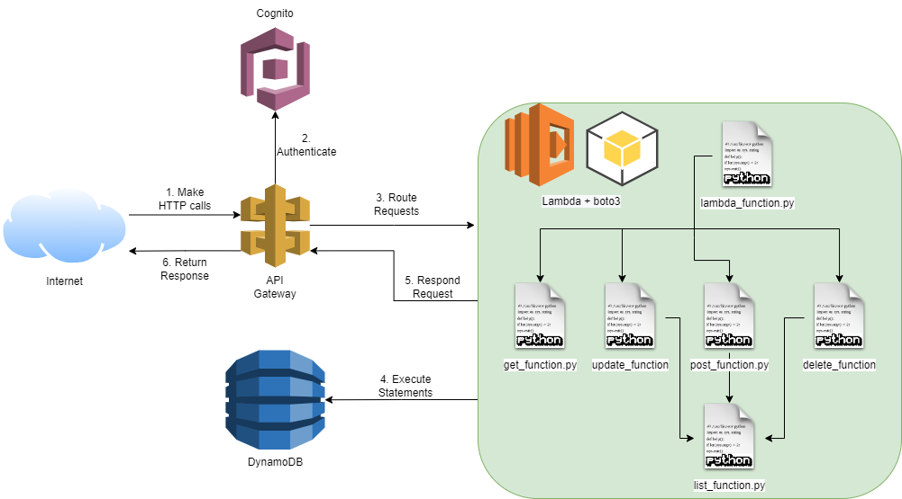

<h1 align="center">
    ☁️ API Gateway + Cognito + Lambda + DynamoDB ☁️
</h1>

<h3 align="center">
    Serverless CRUD API
</h3>

## 📚 About 📚
For now, I'm just sharing the Lambda code for a serverless API with CRUD functionality on a DynamoDB table.
In the future, I'll share yaml files used to create infrastructure as a code with CloudFormation.

- Information about DynamoDB table:  
  - Partition Key: courseId (String)
  - Sort Key: studentId (String)
  - Index: CourseName-index
    - Index Partition Key: courseName (String)

- Information about Cognito:
  - No special settings, just create a new User Pool, Users, etc. 

## 🏛️ Diagram 🏛️

## 🚧 Contributing 🚧
If you see a potential improvement in coding, structure or best practices, please, let me know. I'm here to learn! 

If you want to contribute, don't be shy! Open a pull request and let's create something better together!

## Show your support

Give a ⭐️ if this repository helped you!

